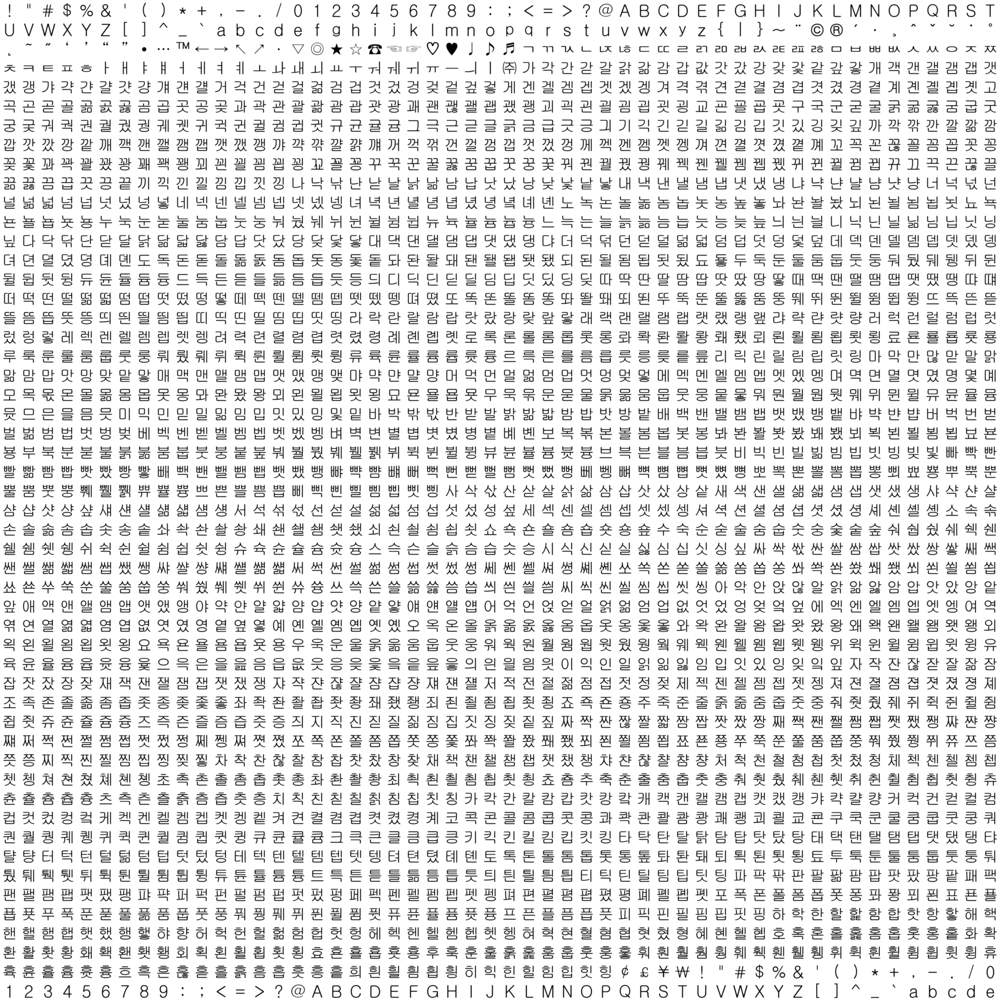

python 기반의 TTF()파일 지원 글리프 확인용 소스 입니다.
---------------

Few-shot Font Generation with Localized Style Representations and Factorization (AAAI 2021)의 학습 데이터셋 생성에 도움이 될 만한 소스입니다.
[git hub DMfont,LFfont,MXfont](https://github.com/clovaai/fewshot-font-generation)
에서 제공하는 "get_chars_from_ttf.py"소스는 ttf파일에서 cmap을 참조합니다.
하지만 cmap에서 아래의 그림처럼 네모박스로 잡혀있는 cmap은 추출 하지 못합니다.

하지만 지원하는 글리프를 한번에 확인 할 수 없었다.

ttf파일의 pillow 데이터 확인용

-----
데이터셋은 
default -> './font'에 .ttf파일을 둡니다.
target_char는 pillow로 프린터 하고 싶은 이미지입니다.

-------------------
step 1 

-----------------------
파라미터 설정
row col
한미지당 사이즈
----------------------

이용방법설명:
1. "target_char.txt"에 png에 그릴 문자를 넣습니다.
2. 퍼스트
3. 
